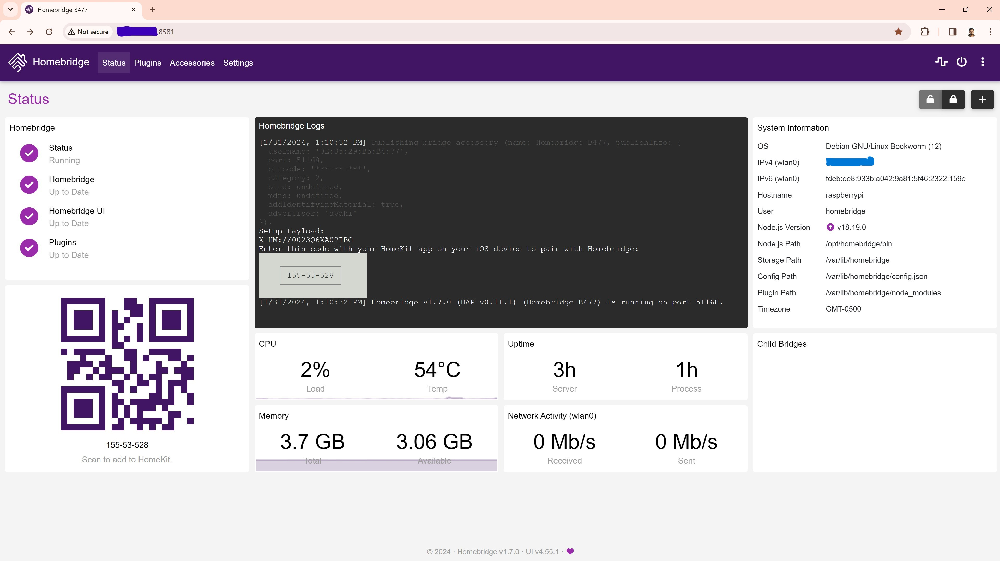

# About
The **homebridge-tcp-smarthome** plugin integrates Apple HomeKit with devices controlled via TCP commands, enabling smart home capabilities directly from your iOS device. Running on a Raspberry Pi with Homebridge, this plugin is designed to send light on/off commands suitable for LMDI-100 devices, as well as window covering commands compatible with Mechonet Network Interfaces. Accessing the accessory in HomeKit triggers the command from Homebridge to a [`TCP Server`](./pico_server.js) running on the Pi, which in turn sends the commands to the [`Pico-W`](https://github.com/RajkumarGara/pico-network-serial-port) TCP client. Commands are transmitted through TCP to this client, which then relays these instructions to the connected devices via RS232. This setup allows for the control of various loads, including lighting and window coverings. Multiple pico-w units can be deployed across an entire floor, ensuring comprehensive coverage and control, as long as they are connected to the same WiFi network as the Raspberry Pi. If this plugin is published to npm, then no need to follow the steps for [Unpublished Plugin](#Adding-unpublished-plugin-to-the-Homebridge); instead, refer [published Plugin](#Adding-published-plugin-to-the-Homebridge).

## Features
1. It supports light and window covering accessories.
2. Number of accessories can be configured. (Refer to `Configure the Plugin` in [Unpublished Plugin](#Adding-unpublished-plugin-to-the-Homebridge) section).
3. Homebridge sends LMDI-100, Mechonet commands to the pico-w through TCP.
4. Individual lights on/off.
5. Individual light brightness control from 0 to 100%.
6. Individual window covering 5-level (0%, 25%, 50%, 75%, 100%).

## Installing Homebridge
* Follow the below steps for Debian OS. Refer [homebridge-installation](https://github.com/homebridge/homebridge/wiki/Install-Homebridge-on-Raspbian#installing-homebridge) for any other OS.
* Add Homebridge Repository
    ```bash
    curl -sSfL https://repo.homebridge.io/KEY.gpg | sudo gpg --dearmor | sudo tee /usr/share/keyrings/homebridge.gpg  > /dev/null
    echo "deb [signed-by=/usr/share/keyrings/homebridge.gpg] https://repo.homebridge.io stable main" | sudo tee /etc/apt/sources.list.d/homebridge.list > /dev/null
    sudo apt-get update
    sudo apt-get install homebridge
    ```

* Install Homebridge
    ```bash
    sudo apt-get update
    sudo apt-get install homebridge
    ```

* Homebridge installation completed: Login to the Homebridge UI by going to `http://<ip address of your server>:8581`.
To find the IP address of your server you can run:
    ```bash
    hostname -I
    ```
    Setup the Homebridge by entering the username and password on homebridge UI.

    
## Adding unpublished plugin to the Homebridge
* Navigate to homebridge terminal by entering below command on your device (Raspberry Pi) terminal.
    ```bash
    sudo hb-shell
    ```

* Develop the plugin:
As a Homebridge user, you can create a new plugin project in a folder (the folder name doesn't have to match the plugin name). Mainly you'll need to implement two files: index.js and package.json.
    1.  index.js: This is where you write the main logic of your plugin. It should export a function that Homebridge will call to register your accessory or platform.
    2.  package.json: This file describes your plugin, including its name, version, and dependencies.

    For more information check [homebridge-API](https://developers.homebridge.io/), [homebridge-plugin-template](https://github.com/homebridge/homebridge-plugin-template) .

* Write the homebridge `config.json` file according to the plugin.
     ```bash
    nano /var/lib/homebridge/config.json
    ```

* Navigate to your plugin folder. Install Development Dependencies. Link to homebridge. Link your plugin to the homebridge (replace `homebridge-tcp-smarthome` with your plugin name). Restart the homebridge.
     ```bash
    cd ~/github/homebridge-tcp-smarthome
    npm install
    npm link
    npm link homebridge-tcp-smarthome
    systemctl restart homebridge
    ```
    You will be asked to enter the homebridge password.

* Plugin successfully added.
    To check your plugin in Homebridge, go to the Homebridge UI and navigate to the "Plugins" section. There, you can view and manage your installed plugins.

* Configure the Plugin: Add/remove accessories:
    1. Open the Homebridge UI and navigate to **Settings > Config JSON Editor**.
    2. Add your desired accessories to the configuration.
    3. Restart Homebridge for the changes to take effect.
    
    For example configuration, refer to [`config.schema.json`](./config.schema.json), which includes settings for 3 lights and 1 window covering accessory.

## Removing unpublished plugin from the Homebridge
* Run below commands in **homebridge terminal** to remove the plugin from homebridge. Replace `homebridge-tcp-smarthome` with your plugin name.
    ```bash
    npm unlink homebridge-tcp-smarthome
    rm -rf /opt/homebridge/lib/node_modules/homebridge-tcp-smarthome
    systemctl restart homebridge
    ```
    You will be asked to enter the homebridge password.

## Connecting homebirdge to homekit
* Follow the steps in [homebridge-homekit](https://github.com/homebridge/homebridge/wiki/Connecting-Homebridge-To-HomeKit).

## Running the setup
* Run [`TCP Server`](./pico_server.js) on Pi. Make sure Node.js was installed before running the code.
    ```bash
    node pico_server.js
    ```
* Execute [`Pico-W`](https://github.com/RajkumarGara/pico-network-serial-port/blob/main/main.py) code by following the steps on [github](https://github.com/RajkumarGara/pico-network-serial-port). Make sure the devices (either LMDI-100 or Mechonet) are connected to the [Pico-W](https://github.com/RajkumarGara/pico-network-serial-port?tab=readme-ov-file#images). 
* Control lights or window coverings directly from Apple HomeKit. 

## Devloper Notes
* To see which plugins are linked to Homebridge, run the following command in the homebridge terminal.
    ```bash
    ls /opt/homebridge/lib/node_modules
    ```

## Images

